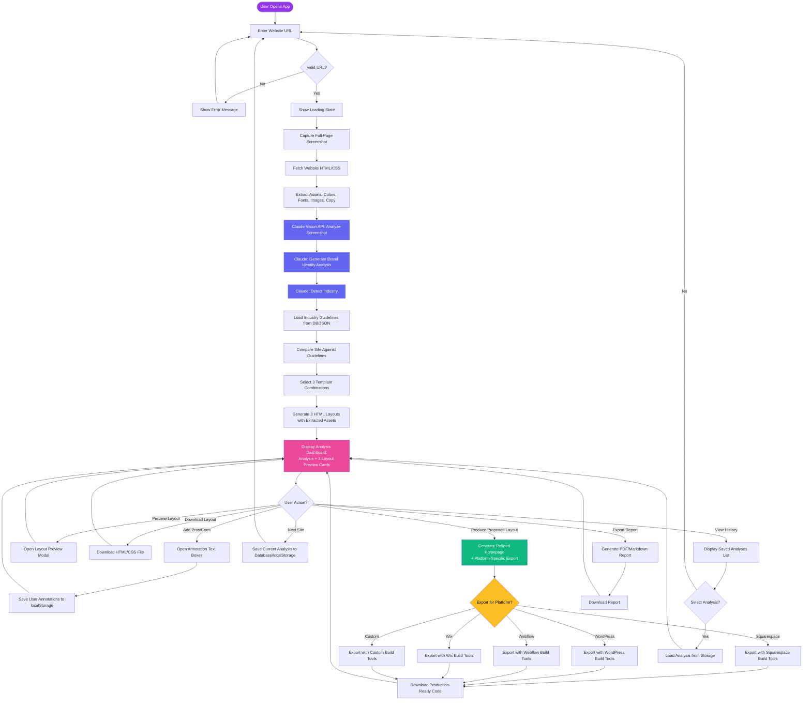
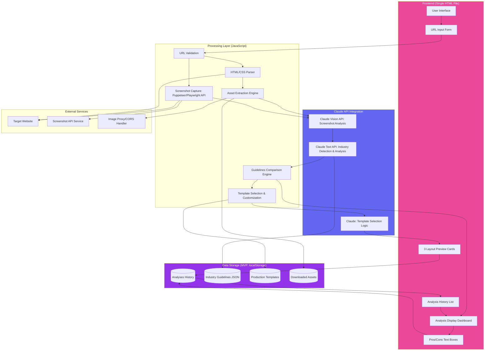
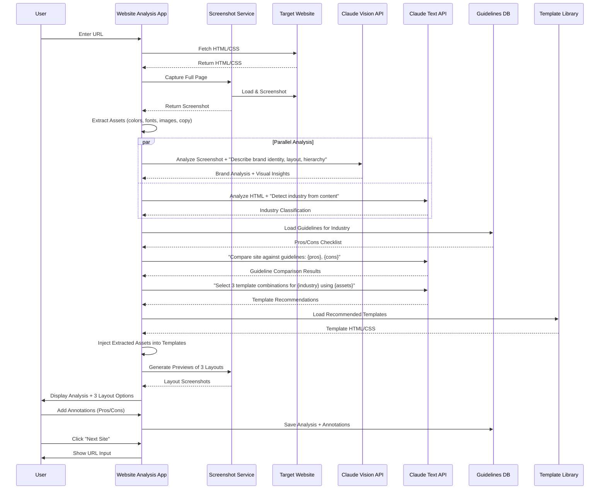
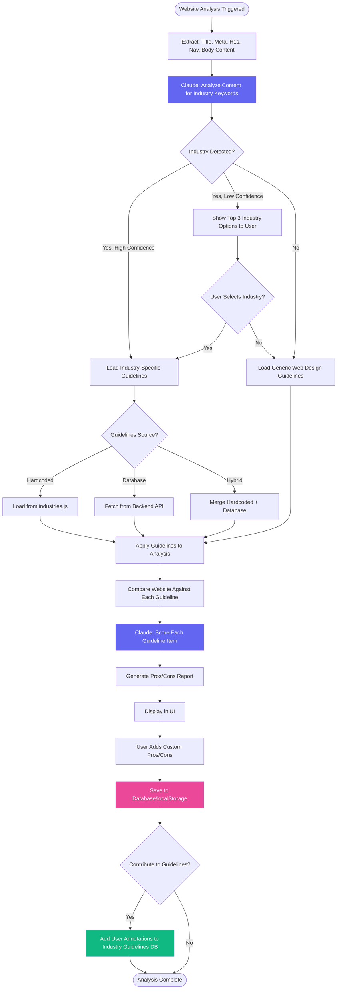
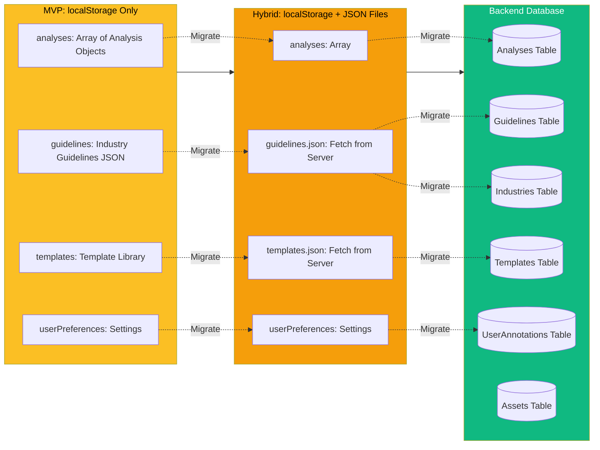

# Website Analysis MVP - All Flowcharts

This document contains all 5 flowcharts for the Website Analysis MVP application in Mermaid format.

---

## 1. Main User Flow

Shows the complete user journey from entering a URL to analyzing the next site.

**Updates in v2:**
- Dashboard now explicitly shows "Analysis + 3 Layout Preview Cards"
- New action: "Produce Proposed Layout" with platform-specific export (Squarespace, WordPress, Webflow, Wix, Custom)

---

## 2. Technical Architecture & Data Flow

Shows the system architecture with all components and their interactions.

---

## 3. Claude Integration Sequence Diagram

Shows the detailed sequence of interactions with Claude APIs and other services.

---

## 4. Industry Guidelines System

Shows how industry detection and guidelines application works, including the growth mechanism.

---

## 5. Data Storage Evolution

Shows the migration path from MVP (localStorage) to production (backend database).

---

## Color Legend

- **Purple (#9333ea)**: Start/End states, Storage operations
- **Pink (#ec4899)**: User actions and interactions
- **Blue (#6366f1)**: Claude API calls
- **Yellow (#fbbf24)**: Decision points
- **Light Blue (#dbeafe)**: Processing steps
- **Green (#10b981)**: Success/completion states
- **Red (#ef4444)**: Error states
- **Orange (#f59e0b)**: Phase 2 in evolution
- **Gold (#fbbf24)**: Phase 1 in evolution

---

## Usage

These Mermaid diagrams can be:

1. **Viewed on GitHub**: GitHub automatically renders Mermaid diagrams
2. **Imported to draw.io**: File → Import → Paste Mermaid code
3. **Imported to Lucid.app**: Create new diagram → Import Mermaid
4. **Rendered online**: Use [Mermaid Live Editor](https://mermaid.live/)
5. **Converted to images**: Use Mermaid CLI or online tools

---

## Technical Notes

**Mermaid Syntax:**
- `flowchart TD` = Top-Down flowchart
- `flowchart LR` = Left-Right flowchart
- `flowchart TB` = Top-Bottom flowchart
- `sequenceDiagram` = Sequence diagram for interactions
- `-->` = Arrow/connection
- `-->|Label|` = Labeled arrow
- `style` = Apply custom colors

**Rendering Requirements:**
- Mermaid.js library (for web rendering)
- Compatible viewer (GitHub, GitLab, Notion, Obsidian, etc.)
- Or export to SVG/PNG for universal compatibility
