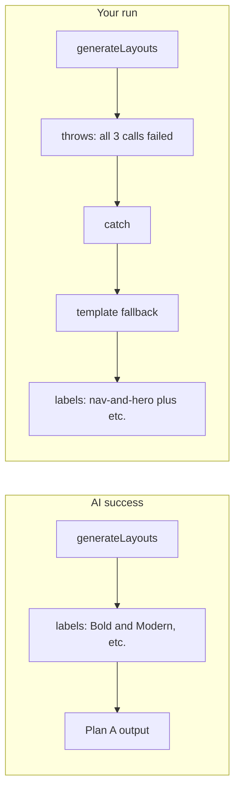

# Why you're seeing fallback output (and how to get Plan A)

## What's going on

**Yes — what you're seeing is 100% fallback output**, not the AI-generated Plan A flow.

Evidence from your screenshots and the code:

1. **Progress showed "Using template fallback…"**
   That string is only sent when the pipeline **catches** a failure from `generateLayouts()` and runs the template path (`lib/pipeline/analyze.ts` around 241–244: `onProgress?.({ step: "layouts", message: "Using template fallback..." })`).
2. **Layout titles are template section names**
   Labels like "Layout 1 — nav-and-hero + testimonials-carousel + features-grid + 1 more" come from the **fallback** branch. There we set `templateLabel` from section names (`lib/pipeline/analyze.ts` ~266) and save it as `layoutNTemplate`.  
   If the **AI** path had succeeded, `layoutNTemplate` would be "Bold & Modern", "Clean & Professional", "Warm & Engaging" (from `lib/ai/generate-layouts.ts` `CREATIVE_DIRECTIONS`).
3. **Same content and "rearrangements of the same components"**
   Fallback uses `selectCompositions` → `composePage` → `injectAssets` → `refreshCopy` (same copy-refresh for all three). So you get three **template-composed** pages with section names as labels and similar copy — exactly the old behavior, not the "3 complete, visually distinct" Plan A pages.

So: the UI is reflecting what the pipeline stored. The pipeline stored fallback data because **AI layout generation failed** for that run.

---

## Is this because of token usage?

**It might be, but we can't tell from the UI alone.**

- The split into **3 parallel calls** was to reduce per-call output size and make JSON parsing more reliable. If **all three** calls still fail, the pipeline still falls back.
- Possible failure reasons:
  - **Token limit** on the response (e.g. one layout's HTML/CSS too large).
  - **Malformed JSON** (e.g. unescaped quotes/newlines in HTML inside the JSON).
  - **Timeouts** or **API errors** (rate limit, 5xx).
  - **Validation** (e.g. `safeParseJSON` fails or `html`/`css` missing).

The **only way to know** is to look at the **server terminal** when you run an analysis. You should see lines like:

- `[generateLayouts] Layout 1 (Bold & Modern) failed: <reason>`
- `[generateLayouts] Layout 2 (Clean & Professional) failed: <reason>`
- `[pipeline] AI layout generation failed, falling back to template composition: generateLayouts: all 3 layout calls failed — …`

That "reason" (and stack) will tell you whether it's parse errors, missing fields, token/timeout, or something else.

---

## Why the "UI changes" don't seem reflected

- **Layout titles:** The frontend shows "Layout N — {templateName}" (`LayoutCard` ~58–61). `templateName` is whatever the pipeline stored in `layoutNTemplate`. On fallback that's the section string; on AI success it would be the creative direction. So the UI is correct; the data is fallback.
- **Design/Copy toggle:** Already hidden; that part is independent of AI vs fallback.
- **"Generating 3 layout proposals…" in the step list:** That's the **static** label for the "layouts" step in `AnalysisProgress.tsx` (line 37). The **current** step label uses the server `message` when present (line 86: `message ?? STEP_LABELS[currentStep]`), so you correctly see "Using template fallback…" for the active step while the list still shows "Generating 3 layout proposals…" for that row.

---

## About the "Blocked script execution in 'about:srcdoc'" console error

The iframe uses `sandbox="allow-same-origin"` **without** `allow-scripts` on purpose (`LayoutCard.tsx` ~69). Generated pages are intended to be CSS-only. If the HTML contains a `<script>` tag (from AI or template), the browser will block it and log that message. It does **not** cause the pipeline to use the fallback; it's a side effect of content inside the iframe.

---

## Recommended next steps (implementation options)

1. **Confirm the failure reason**
   - Run another analysis and watch the **server** logs (not the browser console).
   - Note the exact error(s) for each `[generateLayouts] Layout N … failed:` and the final `[pipeline] AI layout generation failed…` message.
2. **Harden AI layout generation** (after you have the failure reason)
   - If **JSON parse** failures: extract a JSON block from the response (e.g. between first `{` and last `}`) before `safeParseJSON`; or ask the model to wrap HTML in a CDATA-like convention to avoid breaking JSON.
   - If **token/timeout**: reduce prompt size (e.g. shorter brand analysis or fewer images), or increase `max_tokens` per layout, or retry a single layout on failure.
   - If **all 3 fail** often: add a single retry for the whole `generateLayouts` (or per-layout) before falling back.
3. **Optional: surface fallback in the UI**
   - Store a flag when `usedTemplateFallback` is true (e.g. a small `layoutSource: "ai" | "template"` or similar) and show a non-intrusive note on the results page when the result used template fallback (e.g. "Layouts were generated using template composition because AI generation was unavailable."). That avoids confusion when titles and quality don't match Plan A.
4. **Optional: align progress copy with Plan A**
   - In `AnalysisProgress.tsx`, change the static label for `layouts` from "Generating 3 layout proposals…" to "Designing 3 unique page concepts…" so the step list matches Plan A wording; the server still sends "Using template fallback…" when fallback runs.

---

## Summary

| Question                           | Answer                                                                                                                             |
| ---------------------------------- | ---------------------------------------------------------------------------------------------------------------------------------- |
| Are these fallback responses?      | **Yes.** The "Using template fallback…" message and section-style titles (nav-and-hero + …, etc.) prove the template path ran.     |
| Why don't I see Plan A UI/quality? | Because the pipeline never stored AI output for that run; it stored fallback output.                                               |
| Is it token usage?                 | **Possibly.** Check server logs for the actual `generateLayouts` failure reason; then target fixes (parse, token, timeout, retry). |

No code changes are made in this plan; it only explains the situation and suggests the above next steps. Once you have the server-side error message from a failing run, we can turn that into a concrete code change plan (e.g. JSON extraction, retries, or prompt/token tweaks).
